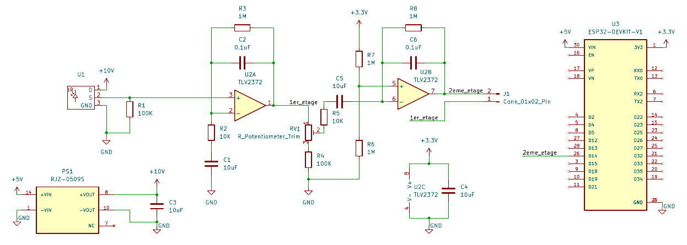
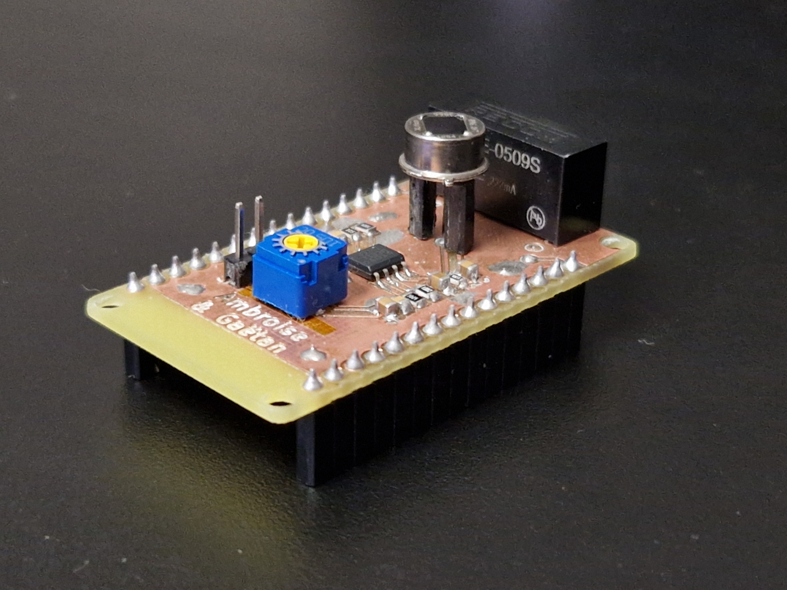
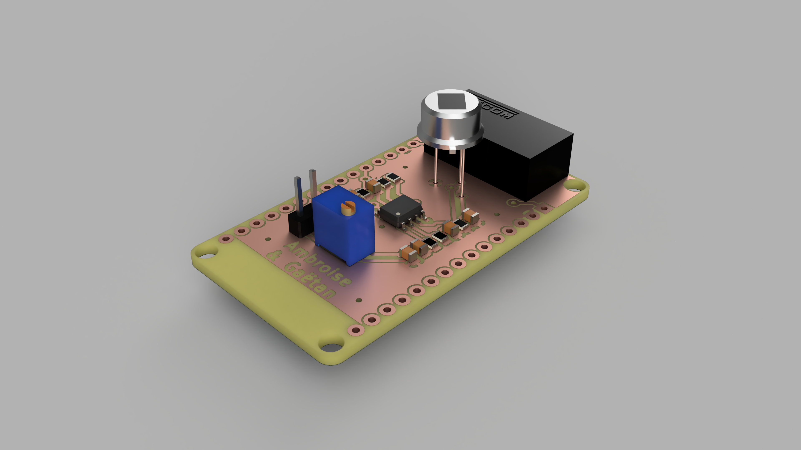
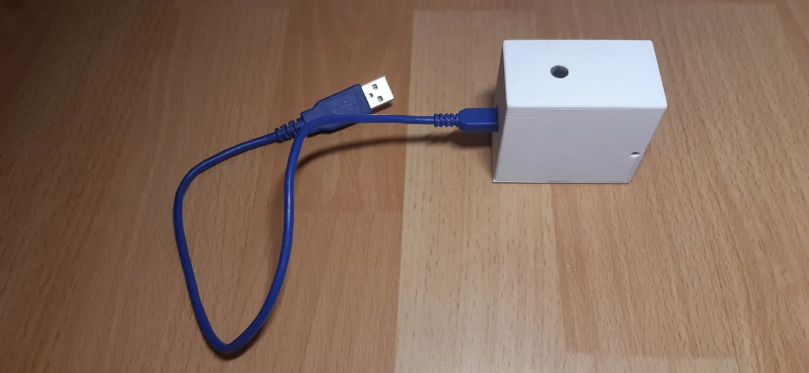
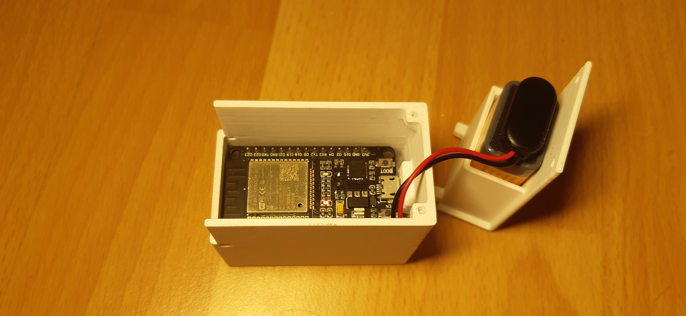

# capteur_IR

Le but de ce projet est de concevoir un capteur de détection de mouvement par infrarouges. Cette solution est modulable et scalable en plus de son coût de fabrication faible.

## Table des Matières

- [Description](#description)
- [Hardware](#hardware)
- [Software](#software)
- [Évolutions](#évolutions)
- [Contributeurs](#contributeurs)

## Description

Il est composé de deux grande parties:
 - Electronique (ESP32 + capteur IR LHI968)
 - Software (code C++ + dashboard avec base de données)

Ce projet a été fait par des étudiants.

## Hardware

La carte électronique est conçu pour être un sheld pour une Esp32 devkit V1.
On a utilisé KiCad pour la concevoir et générer le modèle 3D.
Et on l'a réalisé en prototypage rapide sur CNC.

Voici le schéma électronique :

Et voici la réalisation final :

## Software

Ce code permet de se connecter à une base de données influxDB via une requête POST.
De notre côté on a choisi d'héberger cette base de données sur une Raspberry Pi et de l'exploiter avec Grafana.

Ce code envoie simplement la tesion du capteur toutes les 100ms à la base de données et tente une reconection au Wi-Fi chaque fois qui pert le signal.

## Boitier

Nous avons aussi conçu un boitier pour le capteur. Il est imprimé en 3D et permet d'intégrer tous les composants de manière esthétique et fonctionnelle. (merci à BHP pour la conception du boitier)

## Évolutions

- [x] Remplacement du convertisseur boost par une pile 9V (ce convertisseur n'est pas recomandé)
- [ ] Lecture de la tension de batterie avec un pont diviseur
- [ ] Scan des periphériques Bluethooth à proximité (distinction autorisé/non-autorisé)
- [ ] Detection sonore, bruit ambiant
- [ ] Camera avec intégration IA (OpenCV)
- [ ] Utiliser l'horloge temps réel de l'ESP32 pour horodater les valeurs grace à un serveur de temps (plus précis)
- [ ] Mettre en place un buffer en cas de coupure de connection pour ne pas perdre de valeurs

## Contributeurs

Ambroise Nedey-Crettaz  
Gaëtan Corabœuf

Sur la proposition de :  
M.Dumas

